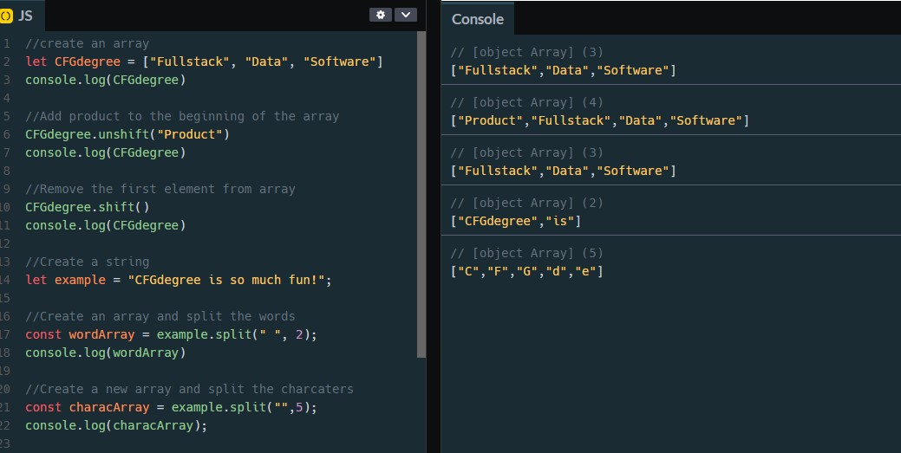
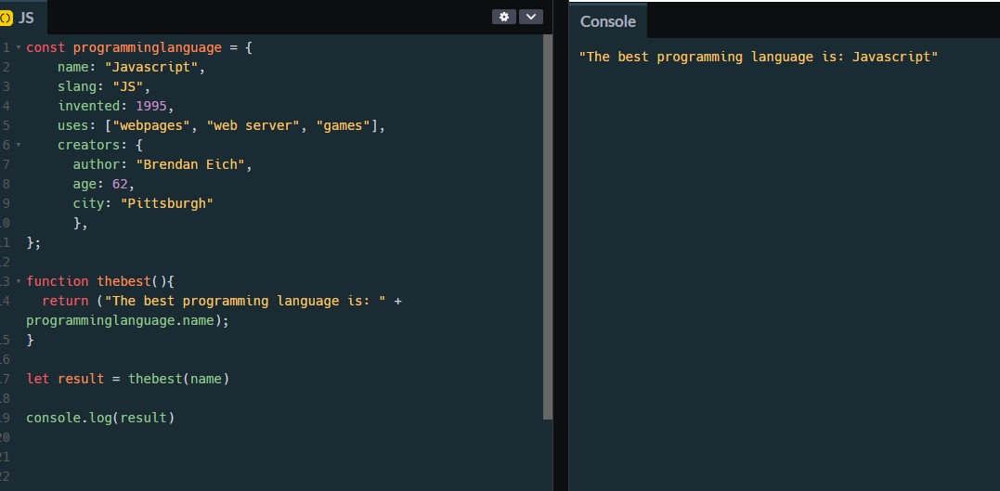

# CFG_Assignment2
Assignment 2 web application for a dream vacation related to the CFG Full stack stream - Helen Allen 

# 
 Assignment 2 

## 2.1.
○ Define unshift(), shift() and split()
> unshift - to add elements to the beginning of an array.

> shift - to remove the first element of an array.

> split - to divide a string into two or more substrings depending on a splitter (or divider.   The splitter can be a single character, another string, or a regular expression.

○ Using the topic of “CFGdegree”, provide an example of unshift(), shift() and
split(). (E.g.The theme could be the different CFGdegree streams.)

<figure>
   <figcaption>Unshift, shift and split examples</figcaption> 
   
</figure>

## 2.2.
○ Define object methods
> The Object data type allows us to store multiple data values together.

○ Using the topic of “Programming Languages”, create a new object and object
methods.

<figure>
   <figcaption>New pbjects and object methods</figcaption> 
   
</figure>

## 2.3.
○ Explain the onmouseover event
> The onmouseover event is when the mouse pointer enters an element, or you hover your mouse over the element, often seen when you hover over a hyperlink and it changes colour. The onmouseover event is often used together with the onmouseout event, which occurs when the mouse pointer leaves the element.

○ Explain two other DOM events of your choosing
> The onclick event is when the user clicks on an element, this is an incredibly powerful event and can be used for so many different outcomes, for example once a link has been clicked the colour chnages.
> The onfocus event The onfocus event is when an element gets focus, and is often used on input fields. For example an input field will change colour when you begin typing in it.

##
# 
 Thank you!
